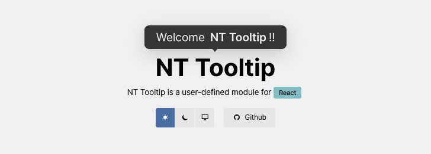

# NT Tooltip

<BeTag class="yellow">Javascript</BeTag>
<BeTag class="deepblue">+React</BeTag>
<BeTag class="red">NPM</BeTag>

## 소개

  `nt-tooltip`은 Javascript로 만든 툴팁 모듈입니다. 커스텀 HTML 속성명(`nt-tooltip`)을 통해 툴팁과 옵션을 적용하며, HTML 작성 시 툴팁이 적용된 대상 엘리먼트를 직관적으로 확인할 수 있습니다. 간단한 텍스트는 속성 값으로 지정할 수 있고, 복잡한 HTML 콘텐츠는 `nt-target` 속성을 가진 자식 엘리먼트로 전달 가능합니다. 툴팁의 표시 방향은 `top`, `bottom`, `left`, `right` 등의 옵션으로 지정할 수 있습니다. (정확히 top-center, top-start, top-end, bottom-center 와 같이 방향-정렬 값으로 표시합니다.) 방향 지정 외 `theme`, `trigger`, `offset`, `size`, `maxWidth`, `padding` 등의 옵션도 지정 할 수 있습니다.
  
  `nt-tooltip` is a tooltip module written in JavaScript. Tooltips and options are applied via a custom HTML attribute (`nt-tooltip`), so you can intuitively see which elements have tooltips when writing HTML. Simple text can be set as the attribute value, and more complex HTML content can be passed through a child element with the `nt-target` attribute. The tooltip placement can be set with options such as `top`, `bottom`, `left`, and `right`. (More precisely, it uses direction-alignment values such as `top-center`, `top-start`, `top-end`, and `bottom-center`.) In addition to placement, you can also set options such as `theme`, `trigger`, `offset`, `size`, `maxWidth`, and `padding`.


## Demo

모든 옵션 및 실행 테스트가 가능한 공식 페이지입니다. 




<div class="be-button" v-nt-tooltip="`Tooltip test`">
  <i class="icon left xi-link" />
  NT Tooptip
  <a class="link" href="https://noistommy.github.io/nt-tooltip" target="_blank" />
</div>
Demo page

## Installation

#### NPM

```bash 
npm install @noistommy/nt-tooltip
```

#### CDN

```html 
<!-- unpkg -->
<script src="https://unpkg.com/@noistommy/nt-tooltip"></script>
<!-- jsdelivr -->
<script src="https://cdn.jsdelivr.net/npm/@noistommy/nt-tooltip"></script>
```


## How to use

#### Registration

::: code-group
```tsx [React(es)]
// app.tsx
import React, { useEffect } from 'react';
// import Module & style
import {initTooltip, clearTooltip } from '@noistommy/nt-tooltip';
import '@noistommy/nt-tooltip/nt-tooltip.css';

function App() {
  useEffect(() => {
    initTooltip();
    return () => {
      clearTooltip();
    }
  }, []);
  ...
}
```
``` javascript [cjs]

const ntTooltip = require('@noistommy/nt-tooltip');
require('@noistommy/nt-tooltip/nt-tooltip.css');

// after mounted Dom
ntTooltip.initTooltip()

```
``` javascript [umd]

// loaded nt-tooltip.umd.js file from CDN(unpkg, jsdelivr)

document.addEventListener('DOMContentLoaded', () => {
  NtTooltip.initTooltip()
})

```

:::

#### Example

```html [example]
<!-- basic -->
<div nt-tooltip="content: tooltip content;">...</div>

<!-- content type -->
<div nt-tooltip="true">
  <div nt-target="true">Tooltip content</div>
</div>

<!-- setting options -->
<div
  nt-tooltip="content: tooltip content; pos: 'right-top'; invert: false; ..."
>
  ...
</div>
```


## Props 

| Name | Type | Default | Description |
| --- | --- | --- | --- |
| content | *string* | `''` | Setting content text of tooltip. |
| selector | *string* | `nt-tooltip` | Setting selector attribute name. |
| pos | *string* | `top-center` | Setting position-aligns of tooltip. |
| invert | *boolean* | `true` | Setting theme of tooltip. |
| trigger | *string* | `hover` | Setting trigger event type. `hover \| click` |
| size | *string* | `''` | Setting size of tooltip. `small \| null` |
| padding | *number* | `8` | Setting padding of tooltip. |
| maxWidth | *number* | `250` | Setting the max width size(px) of tooltip. |
| textAlign | *string* | `center` | Setting alignment of tooltip content. |
| offset | *number* | `10` | Setting distance offset between tooltip and target Element. |
| customClass | *string* | `''` | Setting user custom classname. |
| zIndex | *string* | `''` | Setting zIndex Tooltip. |


## 링크

<div class="be-button">
  <i class="icon left xi-github" />
  Github
  <a class="link" href="https://github.com/noistommy/nt-tooltip.git" target="_blank" />
</div>
<div class="be-button">
  <i class="icon left xi-package" />
  npm
  <a class="link" href=" https://www.npmjs.com/package/@noistommy/nt-tooltip" target="_blank" />
</div>
